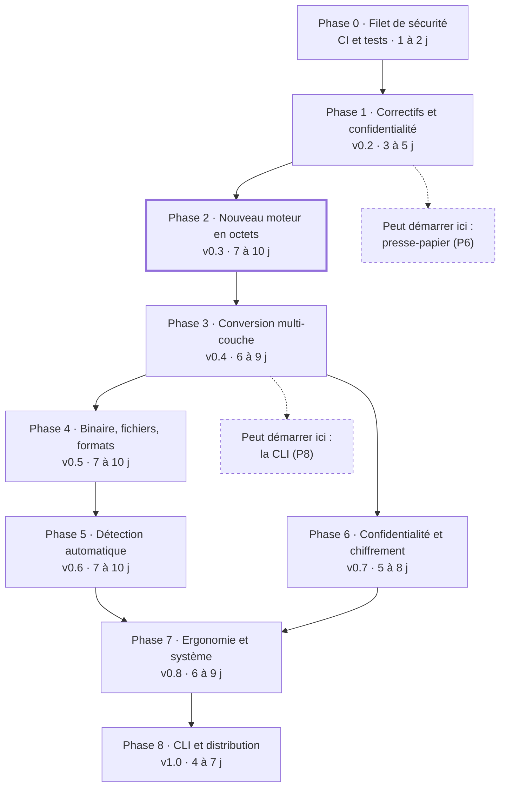
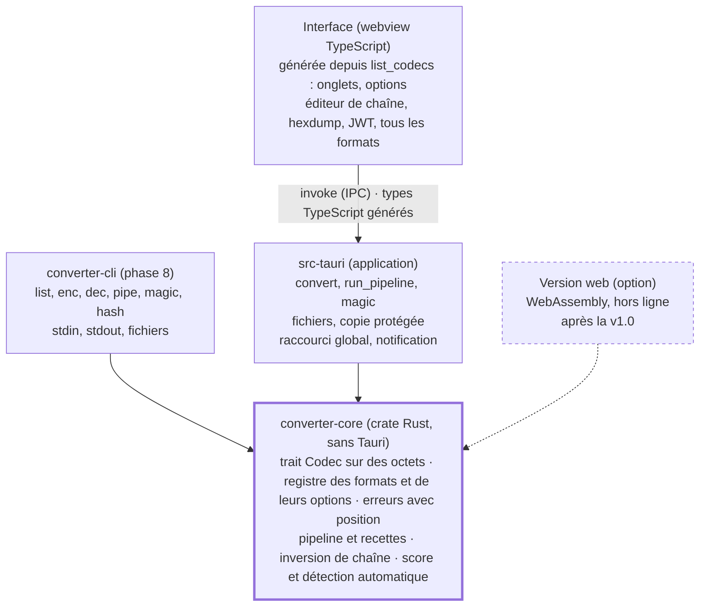

# Roadmap Glass Converter

Mise à jour : 30 septembre 2026

Neuf phases, estimées à 46 à 70 jours pour une personne à temps plein, mènent Glass Converter à une v1.0. Elle corrige tous les points de l'analyse du projet du 30 septembre 2026 et intègre la conversion multi-couche et les 13 idées.

La phase 2, qui fait passer le moteur du texte aux octets, est le pivot : multi-couche, fichiers, chiffrement et détection automatique en dépendent. Les codes des tâches renvoient à l'analyse : B bloquant, D défaut, A amélioration, I idée, MC multi-couche.

## Vue d'ensemble

La phase 2 (moteur en octets) conditionne tout ce qui suit. Les flèches montrent les dépendances ; en pointillé, ce qui peut démarrer plus tôt.

Après la phase 3, deux branches peuvent avancer en parallèle : les phases 4 et 5 d'un côté, la phase 6 de l'autre.

## Architecture cible

Un seul moteur Rust sert l'application, la ligne de commande et le web.

L'interface ne convertit plus rien elle-même : elle appelle l'application, qui délègue tout au moteur partagé, testé une seule fois.

## Règles pour chaque phase

Une phase n'est terminée que si ces cinq règles tiennent.

- Chaque correctif arrive avec un test qui échouait avant lui.
- La CI est verte : `cargo fmt --check`, `cargo clippy -- -D warnings`, `cargo test`, `tsc`, `vite build`.
- Aucune requête réseau, et aucune écriture sur disque sans action explicite de l'utilisateur.
- Une phase livrée = une version taguée, un CHANGELOG et un README à jour.
- Les durées supposent une personne à temps plein, code, tests et documentation compris.

## Phase 0 · Filet de sécurité

En 1 à 2 jours, la CI et des tests de référence permettent de tout modifier ensuite sans casser l'existant. Pas de version publiée : elle prépare la v0.2.

- [x] A21 · CI GitHub Actions (Windows et Ubuntu) : format, clippy, tests Rust, `npm ci`, `tsc`, `vite build`.
- [x] A20 · Vecteurs officiels RFC 4648 pour Base16, Base32 et Base64.
- [x] A20 · Test de propriété (`proptest`) : décoder(encoder(x)) = x pour chaque format réversible. Punycode, Inversion, César, HTML et Morse, connus comme faux, sont exclus jusqu'à la phase 1.
- [x] A22 · Corriger les 6 avertissements clippy (`FromStr`, `is_multiple_of`, `rem_euclid`, `replace` enchaînés).
- [x] A22 · Nettoyer les restes du modèle : nom `glass-converter` dans `package.json`, `authors` dans `Cargo.toml`, `src/assets/*.svg` inutilisés.
- [x] A22 · Ajouter une LICENSE et une source unique pour le numéro de version.
- [x] Rendre le README vérifiable : retirer « suite complète de tests » tant que ce n'est pas vrai.

**Sortie :** la CI est verte sur `main` et bloque toute PR en échec.

## Phase 1 · Correctifs et confidentialité

La v0.2 sort en 3 à 5 jours sans aucun résultat faux ni aucune requête réseau, sur l'architecture actuelle. Chaque tâche livre son test de non-régression.

**Moteur**

- [x] B2 D7 A4 · Punycode : ne décoder que les labels `xn--`, encoder avec `idna::domain_to_ascii`, découper sur les espaces avant les points. Tests : `xn--caf-dma.com` → `café.com`, `example.com` inchangé, `Café.fr` → `xn--caf-dma.fr`.
- [x] B3 A7 · Base64 : décodage avec `DecodePaddingMode::Indifferent` et alphabet détecté (`-_` ou `+/`). Tests : `SGVsbG8` → `Hello`, contenu d'un JWT décodé.
- [x] B4 · Supprimer le `trim()` global : hex, binaire, Base64, Base32, décimal, octal et Morse gèrent eux-mêmes les blancs ; les autres formats gardent l'entrée intacte.
- [x] D5 A6 · Inversion par graphèmes (`unicode-segmentation`). Test : `👍🏽` reste `👍🏽`.
- [x] D6 A5 · Entités HTML5 complètes (`htmlize`). Test : `été …` → `été …`.
- [x] D4 · Morse : `É` en `..-..` (ITU), option pour les autres caractères (erreur, ignorer, translittérer `à` en `A`), retours à la ligne conservés.
- [x] D8 · Base32 : refuser les longueurs impossibles et le padding incohérent (`A` devient une erreur).
- [x] D8 · Hex : accepter `-`, `\x`, `%`, `0x`, `:` et `,` comme séparateurs ; tout autre caractère reste une erreur.
- [x] D8 · Positions d'erreur calculées sur le texte saisi, pas sur le texte nettoyé.

**Interface**

- [x] D2 · En cas d'erreur : vider le résultat et les compteurs, désactiver « Copier » et « Inverser ».
- [x] D3 · Audio Morse : garder les oscillateurs programmés pour vraiment les arrêter, identifiant de lecture contre l'ancien minuteur, 7 unités entre deux mots.
- [x] D1 · Exemples de décodage produits en encodant l'exemple clair avec les options courantes : plus d'exemple faux ni de coquille, décalage César respecté.
- [x] A18 · Rendre le message d'erreur sélectionnable.
- [x] A15 · Presse-papier via `tauri-plugin-clipboard-manager`, avec un message visible en cas d'échec.

**Performance et confidentialité**

- [x] B6 A10 · Commande `async` (calcul dans `spawn_blocking`) et numéro de requête côté interface pour ignorer les réponses périmées.
- [x] A11 · Avertir au-delà de 5 Mo saisis, refuser au-delà de 50 Mo (le mode fichier arrive en phase 4).
- [x] B7 A12 · Polices embarquées (`@fontsource-variable/inter`, `@fontsource-variable/jetbrains-mono`), liens Google supprimés.
- [x] B7 A12 · CSP stricte (`default-src 'self'`, IPC seul en `connect-src`) ; pas de `devCsp`, car Tauri n'applique pas de CSP au serveur Vite de développement.
- [x] B7 · Webview en navigation privée (`"incognito": true`) : ni cache ni stockage sur disque.
- [x] A13 · `withGlobalTauri: false`.
- [x] A14 · Retirer `tauri-plugin-opener` (Cargo, `lib.rs`, capability, `package.json`).
- [x] B7 · La CI échoue si `dist/` contient une URL externe.

**Sortie :** le test de propriété couvre tous les formats (Morse sur entrée normalisée), et une capture réseau au lancement ne montre aucune requête.

**Risque :** le Morse reste volontairement avec perte, tout en majuscules. Le documenter plutôt que le « corriger ».

## Phase 2 · Nouveau moteur en octets

La v0.3 arrive en 7 à 10 jours avec un moteur qui manipule des octets, où un format tient dans un seul fichier. C'est le pivot : les phases 3 à 8 en dépendent.

**Décision avant de commencer :** garder l'interface en TypeScript seul ou migrer vers un framework (voir [Décisions à prendre](#décisions-à-prendre)).

**Moteur**

- [x] I13 · Workspace Cargo : `crates/converter-core` sans Tauri, dont dépend `src-tauri` ; les tests du moteur tournent sans webview.
- [x] B1 A1 · Trait `Codec` sur des octets (`&[u8]` → `Vec<u8>`) ; chaque format déclare s'il attend du texte UTF-8.
- [x] B5 A1 · Registre des formats : identifiant, libellé, catégorie, alias, réversible ou non, schéma d'options (booléen, choix, entier borné, texte, secret).
- [x] B5 · Porter les 12 formats, chacun dans son fichier avec ses tests.
- [x] A2 · Erreur structurée (`thiserror`) : code traduisible, message, plage fautive.
- [x] A1 · Commandes `list_codecs` et `convert` (async) ; sortie en texte si l'UTF-8 est valide, sinon en octets.
- [x] A3 · Types TypeScript générés depuis Rust (`tauri-specta` ou `ts-rs`) ; la CI vérifie qu'ils sont à jour.
- [x] A7 · Option Base64 URL-safe sans « = », pour les JWT.
- [x] A8 · URL : mode « composant » (actuel) et mode « URI complète » qui garde `:/?#&=` ; option « + = espace ».
- [x] A9 · Renommer « ASCII Décimal/Octal » en « Octets (décimal/octal) ».

**Interface**

- [x] B5 A16 · Onglets et options construits depuis `list_codecs`, onglets groupés par catégorie.
- [x] A2 · Surligner la plage fautive dans l'entrée et afficher sa position.
- [x] A17 · Accessibilité dès la reconstruction : `role="tablist"` et `tab`, `aria-selected`, `aria-pressed`, `role="alert"`, `aria-live`, flèches du clavier.

**Sortie :** ajouter un format ne touche qu'un fichier Rust et son test, et les tests des phases 0 et 1 passent à l'identique.

**Risque :** régressions pendant le portage. Parade : porter un format à la fois, tests verts à chaque étape.

## Phase 3 · Conversion multi-couche

La v0.4 livre en 6 à 9 jours l'enchaînement de couches, le résultat de chacune et l'inversion de la chaîne en un clic.

**Moteur**

- [ ] MC · `Pipeline` : couches (format, sens, options, activée ou non) exécutées sur des octets ; arrêt à la première erreur, qui nomme sa couche.
- [ ] MC · Commande `run_pipeline` : un seul appel pour toute la chaîne ; pour chaque couche, un aperçu tronqué à 4 Ko, la taille, UTF-8 ou non, la durée.
- [ ] MC · Inversion : ordre et sens inversés, refusée si une couche est irréversible.
- [ ] MC · Recette versionnée : JSON `{"v":1,"steps":[…]}` et forme courte `b64:dec|hex:dec` ; les options secrètes ne sont jamais exportées.
- [ ] I3 · Compression gzip, zlib, deflate et brotli (`flate2`, `brotli`), avec un plafond de sortie contre les bombes de décompression.

**Interface**

- [ ] MC · Bascule « Simple / Chaîne » : la conversion en cours devient une chaîne d'une couche.
- [ ] MC · Cartes de couche : format (liste avec recherche), sens, options, activer, supprimer, réordonner à la souris et au clavier (`Alt+↑/↓`).
- [ ] MC · Aperçu et statut sous chaque couche ; la couche en erreur est mise en évidence.
- [ ] I4 · Résultat final non UTF-8 affiché en hexdump (décalage, hex, ASCII), copiable en hex ou en Base64.
- [ ] MC · Recettes prêtes à l'emploi : Base64 double, Data URI, gzip + Base64, SAML (deflate + Base64 + URL).
- [ ] MC · Export et import d'une recette par copier-coller de sa forme courte.

**Sortie :** toute chaîne réversible aléatoire de 1 à 4 couches, suivie de son inverse, redonne l'entrée. `NDg2NTZjNmM2Zg==`, décodé par Base64 puis Hex, donne `Hello`.

**Risque :** chaque couche recopie les données en mémoire. Parade : plafond de taille par couche et aperçus tronqués.

## Phase 4 · Binaire, fichiers et formats

La v0.5 ajoute en 7 à 10 jours les fichiers et les formats qui manquent aux cas réels.

**Fichiers**

- [ ] I4 · Ouvrir et enregistrer (`tauri-plugin-dialog`) ; lecture et écriture côté Rust, seulement pour les chemins venus d'un dialogue ou d'un glisser-déposer.
- [ ] I4 B6 A11 · Glisser-déposer dans l'entrée ; au-delà de 5 Mo, mode fichier : aperçu seul et résultat enregistré directement.
- [ ] I4 · Data URI : type MIME détecté par signature (`infer`), génération et décodage vers un fichier.
- [ ] I4 · Hexdump virtualisé pour les gros contenus.

**Formats**

- [ ] I5 · Hachages SHA-256, SHA-512, SHA3-256, BLAKE3 et CRC32 ; MD5 et SHA-1 marqués « non sûrs, compatibilité » ; sortie hex ou Base64.
- [ ] I5 · HMAC-SHA256 (clé en option secrète) et champ « comparer avec un hash attendu ».
- [ ] I7 A9 · UTF-16 LE/BE, points de code `U+XXXX`, échappements `\uXXXX` (paires de substitution comprises) et `\xHH`.
- [ ] I7 · Quoted-Printable, Base58, Ascii85, Z85, Base45 et Base36.
- [ ] I7 · Réparer les accents cassés : réinterpréter Windows-1252 en UTF-8 (`encoding_rs`) tant que le score s'améliore. Test : `été` → `été`.

**Lecteur de JWT**

- [ ] I6 · En-tête et contenu en JSON lisible ; `exp`, `iat` et `nbf` en dates (« expiré depuis 3 j »).
- [ ] I6 · Alerte sur `alg: none` ; vérification HS256, HS384 et HS512 avec le secret.

**Sortie :** un fichier de 100 Mo traverse une chaîne gzip + Base64 sans figer l'interface, et chaque nouveau format passe ses vecteurs officiels quand ils existent.

**Risque :** accès disque arbitraire depuis l'interface. Parade : liste blanche des chemins tenue côté Rust.

## Phase 5 · Détection automatique et cryptanalyse

La v0.6 permet en 7 à 10 jours de coller une chaîne inconnue et d'obtenir la recette qui la décode.

**Décodage automatique**

- [ ] I1 · Score partagé : caractères imprimables, UTF-8 valide, entropie de Shannon, fréquences des lettres FR/EN (khi²), petite liste de mots FR/EN, signatures de fichiers (gzip, zip, PNG, PDF, JPEG).
- [ ] I1 · Méthode `detect()` optionnelle par format : jeu de caractères, longueur, structure (Base64 multiple de 4, hex de longueur paire).
- [ ] I1 · Recherche en faisceau : largeur 5, profondeur 5, budget de 250 ms ; candidats classés avec aperçu et raison du classement.
- [ ] I1 · « Appliquer » charge la recette dans l'éditeur de chaîne ; une signature de fichier propose l'enregistrement.
- [ ] I1 · Corpus généré (1 à 4 couches aléatoires sur des phrases FR/EN et du binaire), mesuré en CI.

**Cryptanalyse et vues**

- [ ] I8 · Chiffrements classiques : Vigenère, Atbash, ROT47, ROT5/ROT18, XOR (clé texte ou hex), Affine, Rail fence, A1Z26, alphabet OTAN.
- [ ] I8 · Force brute : 25 décalages César et 256 clés XOR d'un octet, classés par le score FR/EN.
- [ ] I10 · Vue « tous les formats » : commande `encode_all`, une carte par format réversible, copie en un clic, filtre par catégorie.

**Sortie :** sur le corpus, objectif de 90 % de bonnes recettes en première position jusqu'à 3 couches, et de 95 % dans les trois premières.

**Risque :** faux positifs, car beaucoup de mots sont aussi du Base64 valide. Parade : pénaliser les décodages qui dégradent le score et toujours montrer plusieurs candidats.

## Phase 6 · Confidentialité avancée et chiffrement

La v0.7 étend en 5 à 8 jours la promesse « Zéro historique » au presse-papier et ajoute un vrai chiffrement. Le presse-papier protégé peut démarrer dès la fin de la phase 1.

**Presse-papier et effacement**

- [ ] I2 · Copie protégée par une commande Rust : sous Windows, formats `ExcludeClipboardContentFromMonitorProcessing`, `CanIncludeInClipboardHistory` = 0 et `CanUploadToCloudClipboard` = 0 ; sous macOS, `org.nspasteboard.ConcealedType` ; sous KDE, `x-kde-passwordManagerHint`.
- [ ] I2 · Effacement automatique après 15, 30 ou 60 s, seulement si le presse-papier contient encore notre copie.
- [ ] I2 · Bouton panique (`Échap` deux fois) : vide entrées, sorties, aperçus, JWT et notre copie ; effacement optionnel après inactivité ou à la réduction de la fenêtre.
- [ ] Option pour masquer la fenêtre aux captures d'écran (`contentProtected`).

**Chiffrement**

- [ ] I9 · Chiffrement par mot de passe au format `age` (crate `age`, armure ASCII), en couche « Chiffrer / Déchiffrer » de la chaîne.
- [ ] I9 · Mot de passe en option secrète : champ masqué, jamais exporté, effacé de la mémoire Rust (`zeroize`, `secrecy`), jauge de robustesse (`zxcvbn`).
- [ ] I9 · Interopérabilité testée en CI avec l'outil `age` officiel, dans les deux sens.

**Durcissement**

- [ ] B7 · Permissions Tauri minimales, `cargo deny` et `npm audit` en CI.
- [ ] Document « modèle de menace » : ce que l'appli protège (disque, réseau, historique du presse-papier) et ce qu'elle ne protège pas (mémoire vive, logiciel espion, enregistreur de frappe).

**Sortie :** sous Windows, une copie protégée n'apparaît pas dans Win+V, et le test `age` passe en CI.

**Risque :** un chiffrement mal utilisé donne une fausse sécurité. Parade : format standard audité, aucun algorithme maison, paramètres fixes.

## Phase 7 · Ergonomie et intégration système

La v0.8 rend l'appli entièrement utilisable au clavier, et disponible même fenêtre fermée, en 6 à 9 jours.

**Clavier et accessibilité**

- [ ] A16 · Palette `Ctrl+K` : recherche floue sur les formats, les recettes et les actions.
- [ ] A16 · Raccourcis : copier le résultat, inverser le sens, tout vider, changer de mode ; aide affichée par `?`.
- [ ] A17 · Audit d'accessibilité (axe-core), contraste AA, focus visible, `prefers-reduced-motion`.
- [ ] A19 · Option « réduire la transparence », sans `backdrop-filter`.
- [ ] Réglages enregistrés côté Rust dans le dossier de configuration : préférences seulement, jamais de contenu.

**Intégration système**

- [ ] I11 · Raccourci global (`tauri-plugin-global-shortcut`), par exemple `Ctrl+Alt+D` pour décoder automatiquement le presse-papier ; résultat recopié en copie protégée.
- [ ] I11 · Icône de zone de notification : décoder ou encoder le presse-papier, ouvrir, tout effacer, quitter ; lancement au démarrage en option.
- [ ] I12 · QR code du résultat (`qrcode`) : niveau de correction réglable, alerte au-delà d'environ 2 900 octets, affichage plein écran.

**Sortie :** toutes les actions sont faisables sans souris, et l'audit axe ne relève aucune erreur grave.

**Risque :** le raccourci global peut entrer en conflit avec d'autres applis. Parade : raccourcis configurables, désactivés par défaut.

## Phase 8 · Ligne de commande, distribution et v1.0

La v1.0 sort en 4 à 7 jours : installable, signée, documentée, avec son outil en ligne de commande.

- [ ] I13 · `crates/converter-cli` (`clap`) : `list`, `enc`, `dec`, `pipe`, `magic`, `hash` ; entrée et sortie standard, fichiers, complétions shell. Possible dès la fin de la phase 3.
- [ ] I13 · Version web hors ligne en WebAssembly : optionnelle, après la v1.0.
- [ ] A21 · Builds de publication sur tag (`tauri-action`) : Windows (NSIS, MSI), macOS universel, Linux (AppImage, deb, rpm).
- [ ] Signature du code Windows et notarisation Apple, selon la décision prise.
- [ ] Mises à jour signées (`tauri-plugin-updater`), désactivées par défaut, avec un bouton « Vérifier ».
- [ ] A22 · Icône propre (`tauri icon`) à la place du logo Tauri.
- [ ] README réécrit avec des promesses vérifiables, guide utilisateur, CONTRIBUTING (« ajouter un format »), SECURITY.md, CHANGELOG.
- [ ] Budgets de performance tenus : 1 Mo converti en moins de 50 ms en build release, interface jamais figée plus de 100 ms.
- [ ] Contrôle v1.0 : phases 0 à 7 terminées, aucun bug bloquant ouvert, zéro requête réseau vérifiée.

**Sortie :** un installateur signé par plateforme visée, publié avec ses notes de version.

## Décisions à prendre

Deux choix sont faits (licence, framework), cinq restent à faire.

| Décision | Options | Recommandation | Avant la phase |
| --- | --- | --- | --- |
| Licence | MIT, Apache-2.0, MIT + Apache-2.0, GPL-3.0 | Décidé (phase 0) : MIT + Apache-2.0 | 0 |
| Framework de l'interface | TypeScript seul, Svelte 5, Solid, Preact | Décidé (phase 2) : Svelte 5 | 2 |
| Enregistrement des recettes | Export seul, ou liste « Mes recettes » sur action explicite | Les deux : une recette ne contient aucune donnée saisie | 3 |
| Format de chiffrement | `age`, ou enveloppe maison AES-256-GCM ou XChaCha20 + Argon2id | `age` : standard, audité, interopérable | 6 |
| Mises à jour | Aucune, vérification manuelle, automatique | Manuelle par défaut, automatique en option : chaque requête réseau doit être choisie | 8 |
| Signature du code | Aucune, Windows, Windows + Apple | Windows d'abord, car SmartScreen avertit sans signature ; Apple si macOS est visé (compte payant) | 8 |
| Version web | Non, ou après la v1.0 | Après la v1.0 | 8 |

## Couverture de l'analyse

Chaque point de l'analyse a sa place dans une phase ; les codes sont ceux des tâches.

| Code | Point de l'analyse | Phase |
| --- | --- | --- |
| B1 | Moteur limité au texte UTF-8 | 2 |
| B2, D7, A4 | Punycode : décodage qui corrompt le texte, encodage non normalisé | 1 |
| B3, A7 | Base64 sans « = » refusé ; option URL-safe sans « = » | 1, 2 |
| B4 | Décodage qui supprime les espaces de début et de fin | 1 |
| B5, A1, A2, A3 | Architecture : registre, erreurs avec position, types générés | 2 |
| B6, A10 | Conversion sur le thread de l'interface | 1 |
| A11 | Grosses entrées : avertissement, puis mode fichier | 1, 4 |
| B7, A12, A13, A14 | Polices Google, CSP désactivée, API globale, plugin inutile | 1, 6 |
| D1 | Exemples faux et coquilles | 1 |
| D2 | Ancien résultat affiché après une erreur | 1 |
| D3 | Audio Morse : arrêt, minuteur, espace entre mots | 1 |
| D4 | Morse : accents et retours à la ligne | 1 |
| D5, A6 | Inversion qui casse emojis et accents | 1 |
| D6, A5 | Entités HTML incomplètes | 1 |
| D8 | Base32 tronqué, séparateurs hex, positions d'erreur | 1 |
| A8 | URL : modes composant et URI complète | 2 |
| A9 | « ASCII Décimal » renommé, points de code | 2, 4 |
| A15 | Presse-papier via plugin | 1 |
| A16 | Catégories, raccourcis, palette `Ctrl+K` | 2, 7 |
| A17 | Accessibilité | 2, 7 |
| A18 | Message d'erreur sélectionnable | 1 |
| A19 | Réduire la transparence | 7 |
| A20 | Tests : vecteurs RFC, propriété, non-régression | 0, puis chaque phase |
| A21 | CI et builds Windows, macOS, Linux | 0, 8 |
| A22 | Restes du modèle, clippy, licence, icône | 0, 8 |
| MC | Conversion multi-couche | 3 |
| I1 | Décodage automatique | 5 |
| I2 | Protection du presse-papier | 6, dès la fin de la 1 |
| I3 | Compression | 3 |
| I4 | Fichiers et binaire | 3, 4 |
| I5 | Hachages | 4 |
| I6 | Lecteur de JWT | 4 |
| I7 | Accents cassés et encodages | 4 |
| I8 | Chiffrements classiques et force brute | 5 |
| I9 | Chiffrement par mot de passe | 6 |
| I10 | Vue « tous les formats » | 5 |
| I11 | Raccourci global et zone de notification | 7 |
| I12 | QR code du résultat | 7 |
| I13 | Moteur séparé, ligne de commande, version web | 2, 8 |
